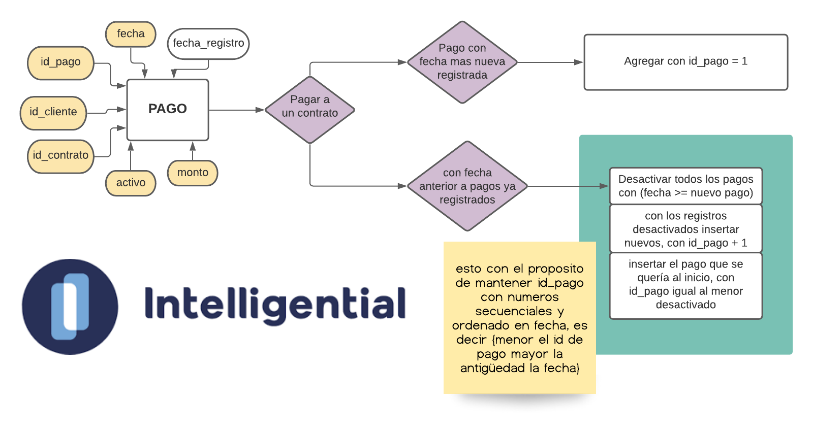

# Prueba [Intelligential](https://www.intelligential.tech/)

<a href="https://github.com/psf/black"></a>

## Los entregables serían:

1. Diagrama entidad-relación del problema. Lo puedes hacer a mano y tomarle foto o si prefieres usar alguna herramienta, adelante.
**(en este mismo readme.md)**

2. Proyecto con scripts necesarios para resolver el problema **(este repositorio)**


# instructions for first-run

###### if you don't have **POETRY**, install it here https://python-poetry.org/docs/
###### if you don't have **PYTHON 3**, install it here https://www.python.org/downloads/
```bash
# create a virtual environment & install dependencies
poetry install

# replace python to python3 in bash if 
# executing 'python --version' is not python 3.x.x
 
# run the program once to generate in-storage db
python src/main.py build_database
# run the program, normally i.e
# remember to replace "--params" with your own :), fecha has this format "%Y-%m-%d"
python src/main.py add_pago --id_contrato=12 --id_cliente=99 --fecha="2021-8-5" --monto=7000

# for more info execute
python src/main.py add_pago --help
```

<br>

# ENTITY-RELATIONSHIP DIAGRAM

